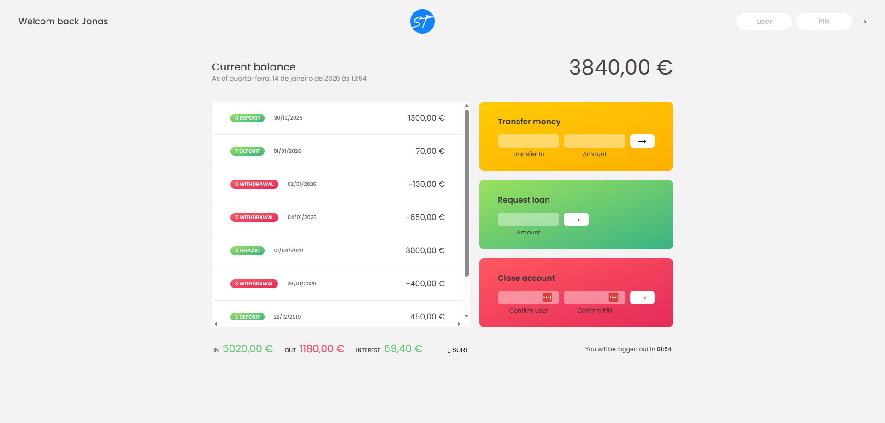

# Bankist Dashboard App (Vanilla JavaScript)

A simple banking application built with **vanilla JavaScript**, demonstrating core JavaScript concepts such as array methods, date & currency formatting, DOM manipulation, and application state management.

This project simulates basic banking operations like login, money transfer, loan requests, and account management.

---

## 🚀 Features

- **User Authentication**

  - Login using username and PIN
  - Personalized welcome message after login

- **Account Balance Display**

  - Real-time balance calculation using transaction history
  - Localized currency formatting

- **Transaction History (Movements)**

  - Displays deposits and withdrawals
  - Shows transaction dates with human-readable format (Today, Yesterday, X days ago)
  - Option to sort transactions ascending/descending

- **Money Transfer**

  - Transfer money between accounts
  - Prevents invalid transfers (insufficient balance, same user, invalid amount)
  - Automatically records transfer dates

- **Loan Request**

  - Loan approval based on transaction history
  - Simulated loan delay for realism
  - Loan date tracking

- **Account Closure**

  - Secure account deletion using username and PIN verification

- **Auto Logout Timer**

  - User is automatically logged out after inactivity
  - Timer resets after every valid action

- **Internationalization**
  - Dates formatted using `Intl.DateTimeFormat`
  - Currency formatted using `Intl.NumberFormat`
  - Locale-based formatting per user account

---

## 🧠 JavaScript Concepts & Techniques Used

- Array methods: `map`, `filter`, `reduce`, `find`, `findIndex`, `some`
- DOM manipulation and event handling
- Application state management
- Date and time handling with `Date`
- Internationalization API (`Intl`)
- Timers with `setInterval` and `setTimeout`
- Conditional rendering and UI updates
- Modular and reusable functions
- Optional chaining (`?.`)
- ES6+ syntax and best practices

---

## 🛠 Tech Stack

- **HTML5**
- **CSS3**
- **Vanilla JavaScript (ES6+)**

---

## 🧪 Test Accounts

Use the following credentials to log in:

| Username | PIN  |
| -------- | ---- |
| js       | 1111 |
| jd       | 2222 |
| stw      | 3333 |
| ss       | 4444 |

---

## 🎯 Project Purpose

This project was built to:

- Strengthen **core JavaScript fundamentals**
- Practice working with **real-world data structures**
- Understand **application logic and state**
- Learn **internationalization and formatting**
- Build confidence without using frameworks

---

## 📷 Preview

---

## 👨‍💻 Author

**Md. Asaduzzaman Rana**  
Front-End Developer  
Focused on JavaScript fundamentals, React.js, and Next.js

---
